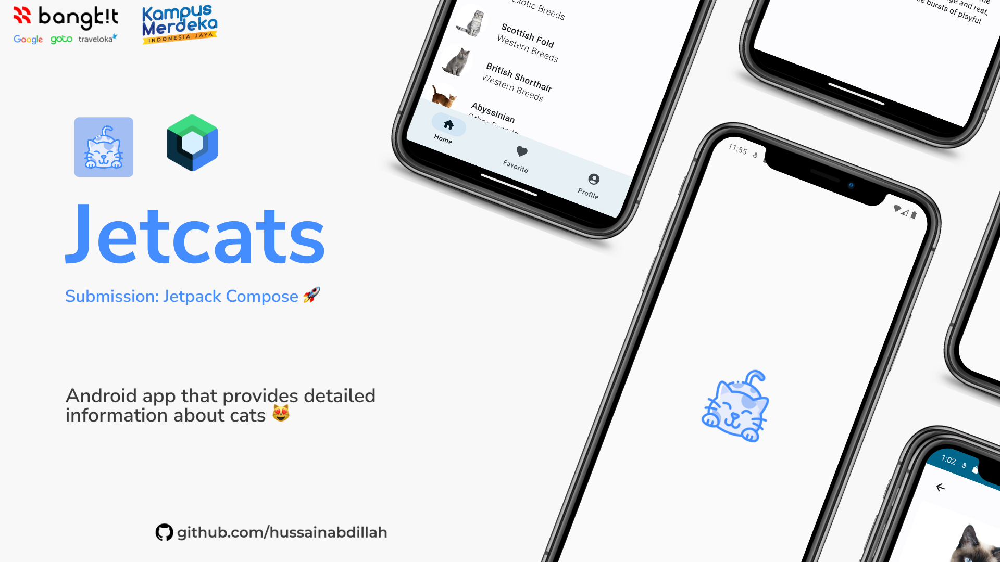

# Jetcats




Jetcats is a sample Android application developed using Jetpack Compose. It showcases the use of modern UI development with Compose for a delightful experience exploring cat breeds.

## Features

- **Cat List:** Explore a list of cat breeds with images and basic information.
- **Cat Details:** View detailed information about a specific cat breed, including its origin, breeds, personality, and more.
- **Favorite Cats:** Mark your favorite cats and view them later in the Favorites screen.
- **Profile:** Personalize your profile with your name and email.

## Screenshots

<!-- Add screenshots or GIFs of your application -->

## Tech Stack

- **Jetpack Compose:** Modern Android UI toolkit for building native UIs.
- **ViewModel:** Manage UI-related data in a lifecycle-conscious way.
- **Room Database:** Provides an abstraction layer over SQLite for data persistence.
- **Navigation Component:** Handle navigation and deep linking while keeping a consistent UI.

## Getting Started

1. **Clone the repository:**
   ```bash
   git clone https://github.com/your-username/Jetcats.git
2. Open with Android Studio:
- Open Android Studio.
- Select "Open an existing Android Studio project."
- Navigate to the cloned project and open it.
3. Run on Emulator or Device:
- Set up an Android Emulator or connect a physical device.
- Click "Run" (green play button) in Android Studio.
